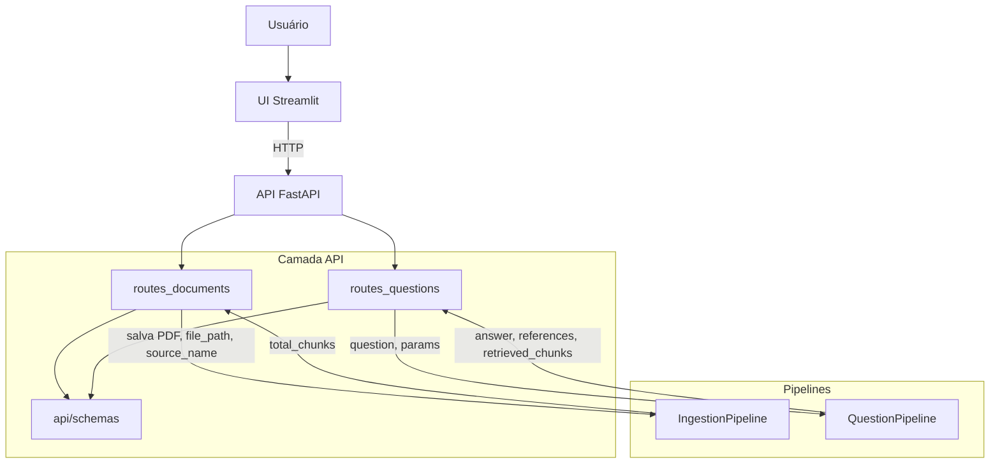
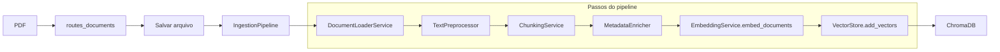
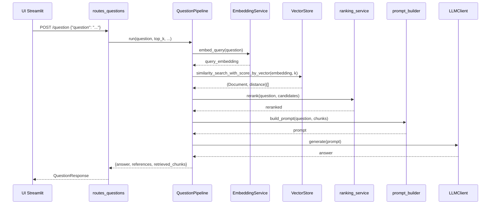

# Árvore do projeto e fluxo de dados

## 1. Árvore do projeto (código fonte)

```
ml_rag_challenge/
├── app/
│   ├── __init__.py              # Exporta app FastAPI e routers
│   ├── main.py                  # FastAPI app, registra routers, GET /health
│   ├── api/
│   │   ├── __init__.py          # Exporta documents_router, questions_router
│   │   ├── routes_documents.py  # POST /documents — salva PDF, chama IngestionPipeline
│   │   ├── routes_questions.py  # POST /question — chama QuestionPipeline
│   │   └── schemas/
│   │       ├── __init__.py      # Exporta DocumentUploadResponse, QuestionRequest, QuestionResponse
│   │       ├── document.py      # DocumentUploadResponse (message, documents_indexed, total_chunks)
│   │       └── question.py     # QuestionRequest (question), QuestionResponse (answer, references, retrieved_chunks)
│   ├── core/
│   │   ├── __init__.py          # Exporta config, dependencies
│   │   ├── config.py            # Settings (Pydantic): chunk, retrieval, LLM, Chroma, upload_dir
│   │   └── dependencies.py     # get_settings, get_vector_store, get_retrieval_service (singletons)
│   ├── pipelines/
│   │   ├── __init__.py          # Exporta IngestionPipeline, QuestionPipeline
│   │   ├── ingestion_pipeline.py   # loader → preprocessor → chunking → metadata → embed → add_vectors
│   │   └── question_pipeline.py    # embed_query → search → filter → dedup → rerank → prompt → LLM → references
│   ├── ingestion/
│   │   ├── __init__.py          # Exporta DocumentLoaderService, TextPreprocessor, ChunkingService, MetadataEnricher
│   │   ├── document_loader_service.py   # Carrega PDF (PyMuPDF), retorna list[{"page", "text"}]
│   │   ├── text_preprocessor.py       # Normalização, remoção de ruído, cabeçalhos/rodapés
│   │   ├── chunking_service.py        # RecursiveCharacterTextSplitter (chunk_size, chunk_overlap)
│   │   └── metadata_enricher.py       # chunk_id, chunk_index, char_count, is_intro_page, section_hint
│   ├── retrieval/
│   │   ├── __init__.py          # Exporta RankingService, rerank, retrieval_helpers
│   │   ├── retrieval_helpers.py # _distance_to_score, _text_similarity, _deduplicate_by_similarity
│   │   └── ranking_service.py   # rerank heurístico (termos da pergunta, definições, penalidades)
│   ├── qa/
│   │   ├── __init__.py          # Exporta build_prompt
│   │   └── prompt_builder.py   # Monta prompt com contexto [Source | Page] e instruções para o assistente
│   ├── embeddings/
│   │   ├── __init__.py          # Exporta EmbeddingService
│   │   └── embedding_service.py # embed_documents(texts), embed_query(text) — única camada que calcula embeddings
│   ├── storage/
│   │   ├── __init__.py          # Exporta VectorStore
│   │   └── vector_store.py     # Chroma: add_vectors, similarity_search_with_score_by_vector
│   └── clients/
│       ├── __init__.py          # Exporta LLMClient
│       ├── llm_client.py        # Fallback de providers (Gemini, OpenAI), generate(prompt)
│       └── providers/
│           ├── __init__.py
│           ├── base.py          # BaseLLMProvider (is_available, generate)
│           ├── gemini_provider.py   # Google GenAI
│           └── openai_provider.py   # OpenAI API
├── ui/
│   ├── __init__.py
│   ├── streamlit_app.py        # Entry Streamlit: set_page_config, abas Upload + Chat, carrega pages
│   ├── config/
│   │   ├── __init__.py
│   │   └── settings.py         # URL da API, timeout (get_settings)
│   ├── pages/
│   │   ├── __init__.py
│   │   ├── 1_upload.py         # Upload de PDF, botão Indexar, chama api_client.upload_document
│   │   └── 2_chat.py           # Chat: input pergunta, api_client.ask_question, exibe resposta e referências
│   ├── components/
│   │   ├── __init__.py
│   │   ├── sidebar.py          # Sidebar com link para API e status
│   │   ├── chat_box.py         # Área de chat (mensagens, input)
│   │   ├── references.py       # Exibição de referências (source - page)
│   │   └── retrieved_chunks.py # Exibição dos chunks recuperados
│   ├── services/
│   │   ├── __init__.py
│   │   └── api_client.py       # health_check, upload_document, ask_question (HTTP para a API)
│   ├── state/
│   │   ├── __init__.py
│   │   └── session_state.py   # init_session_state (Streamlit)
│   └── utils/
│       ├── __init__.py
│       ├── validators.py       # Validações (ex. PDF)
│       └── formatters.py       # Formatação de texto/dados para exibição
├── tests/
│   ├── conftest.py             # Fixture test_client (TestClient FastAPI)
│   ├── test_api_health.py      # GET /health
│   ├── test_api_documents.py   # POST /documents (mock IngestionPipeline)
│   ├── test_api_question.py    # POST /question
│   ├── test_config.py          # Settings, env
│   ├── test_dependencies.py    # get_vector_store, get_retrieval_service singletons
│   ├── test_prompt_builder.py  # build_prompt
│   ├── test_retrieval_service.py # DummyRetrievalService, top_k
│   ├── test_vector_store.py    # add_vectors, similarity_search_with_score_by_vector
│   ├── test_qa_service.py      # QuestionPipeline com mocks
│   ├── test_llm_client.py      # LLMClient
│   ├── test_llm_client_manual.py
│   ├── test_llm_routing_manual.py
│   ├── test_gemini_provider.py # GeminiProvider
│   ├── test_documents.py
│   └── test_questions.py
├── scripts/
│   └── benchmark_retrieval.py  # Benchmark de retrieval (perguntas fixas, top-1/3/5), usa QuestionPipeline
├── requirements.txt
├── .env.example
├── README.md
├── REFATORACAO_ARTEFATOS.md
├── Dockerfile.api
├── Dockerfile.ui
└── docker-compose.yml
```

---

## 2. O que cada parte faz (resumo)

| Camada / pasta | Papel |
|-----------------|--------|
| **app/main.py** | Cria o app FastAPI, inclui os routers de documents e questions, expõe GET /health. |
| **app/api/** | Rotas HTTP: validam request (schemas), chamam pipelines, devolvem response (schemas). Schemas em app/api/schemas/. |
| **app/api/schemas/** | Contrato da API: modelos Pydantic para body e resposta (validação e serialização). |
| **app/pipelines/** | Orquestração: IngestionPipeline (documento → vetores), QuestionPipeline (pergunta → retrieval + geração + references). |
| **app/ingestion/** | Loader PDF, preprocessador, chunking, enriquecimento de metadados. |
| **app/retrieval/** | Helpers (dedup, score) e ranking heurístico. |
| **app/qa/** | Montagem do prompt para o LLM. |
| **app/embeddings/** | Única camada que calcula embeddings (documentos e pergunta). |
| **app/storage/** | VectorStore: persiste e consulta vetores no Chroma (add_vectors, similarity_search_with_score_by_vector). |
| **app/clients/** | LLMClient com fallback de providers (Gemini, OpenAI). |
| **app/core/** | Configuração (Settings) e dependências (get_vector_store, get_retrieval_service). |
| **ui/** | Frontend Streamlit: upload de PDF e chat; consome a API via api_client. |
| **tests/** | Testes da API, pipelines, vector store, LLM, config. |
| **scripts/** | Benchmark de retrieval (QuestionPipeline). |

---

## 3. Fluxo de dados (diagrama Mermaid)

### 3.1 Visão geral: usuário → UI → API → pipelines



### 3.2 Pipeline de ingestão (documento → vetores no Chroma)



### 3.3 Pipeline de pergunta (QuestionPipeline: pergunta → chunks → prompt → LLM → references)

```mermaid
flowchart LR
  Q["Pergunta"]
  QuestionP["QuestionPipeline"]

  Q --> QuestionP

  subgraph QuestionSteps ["Passos do pipeline"]
    E2["EmbeddingService.embed_query"]
    S["VectorStore.similarity_search_with_score_by_vector"]
    F["filter + dedup"]
    R["rerank"]
    Fmt["format list dict"]
    PB["prompt_builder"]
    LLM["LLMClient.generate"]
    Refs["monta references"]
    E2 --> S --> F --> R --> Fmt
    Fmt --> PB --> LLM --> Refs
  end

  QuestionP --> E2
  Refs --> Out["answer, references, retrieved_chunks"]
```



### 3.4 Fluxo completo de uma pergunta (POST /question)



---

## 4. Dependências entre camadas

- **API** depende de **schemas** (app/api/schemas) e **pipelines** (IngestionPipeline, QuestionPipeline).
- **Pipelines** dependem de **ingestion**, **retrieval**, **qa**, **embeddings**, **storage** (VectorStore) e **clients** (LLM).
- **UI** depende apenas da **API** (HTTP); não importa nada de `app` além do que a API expõe.
- **core** (config, dependencies) é usado por pipelines, storage, embeddings, clients.

Nenhuma dependência no sentido inverso: pipelines não importam api; api não contém lógica de negócio além de chamar pipelines.
