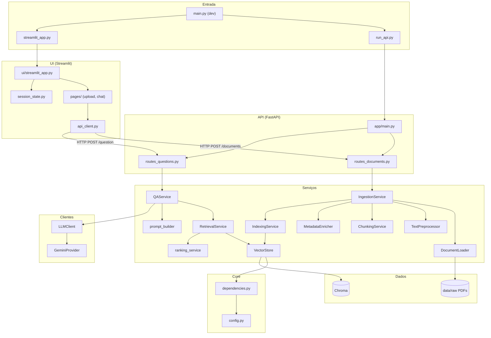
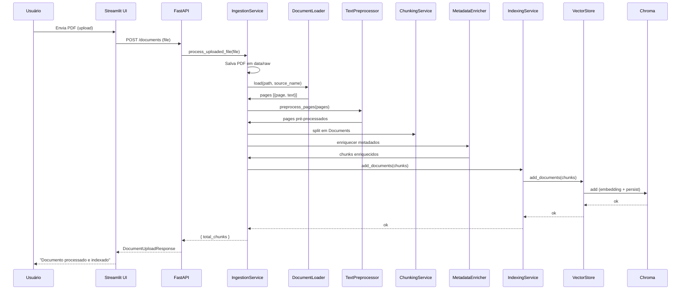
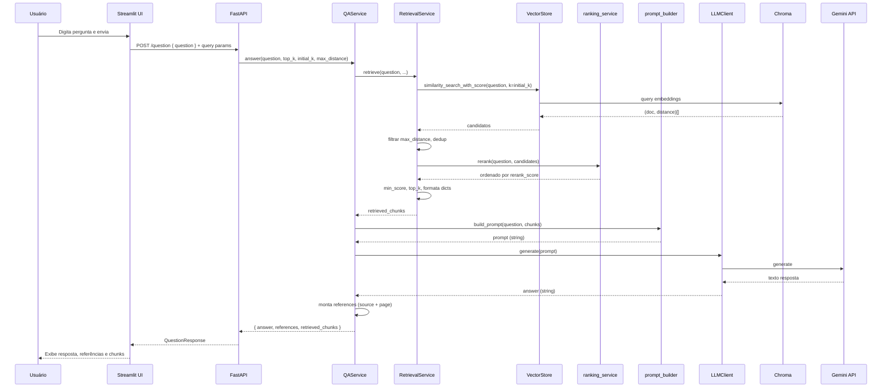

# Funcionamento Detalhado do App — ML RAG Challenge

Este documento descreve a arquitetura, as responsabilidades de cada componente e os fluxos de dados do sistema RAG (Retrieval-Augmented Generation).

---

## 1. Visão geral do sistema

O app é um **sistema RAG** que:

1. **Ingere PDFs**: recebe arquivos PDF, extrai texto, pré-processa, divide em chunks e indexa em um banco vetorial (Chroma).
2. **Responde perguntas**: dado um texto de pergunta, busca os chunks mais relevantes (busca vetorial + reranking), monta um prompt com contexto e envia para um LLM (ex.: Gemini), retornando a resposta e as referências.

A comunicação com o usuário acontece por:

- **API REST (FastAPI)** — endpoints `/documents` (upload) e `/question` (perguntas).
- **Interface Streamlit** — consome a API via HTTP; não acessa diretamente serviços ou banco de dados.

---

## 2. Estrutura do projeto e camadas

| Camada        | Pasta / arquivos                    | Função principal                                      |
|---------------|-------------------------------------|--------------------------------------------------------|
| **Entrada**   | `main.py`, `run_api.py`, `streamlit_app.py` | Orquestração em dev e pontos de entrada da API e da UI |
| **API**       | `app/main.py`, `app/api/`           | FastAPI: rotas, validação, delegação para serviços     |
| **Core**      | `app/core/`                         | Configuração e injeção de dependências (embedding, vector store) |
| **Serviços**  | `app/services/`                     | Lógica de ingestão, retrieval, Q&A e vector store     |
| **Clientes**  | `app/clients/`                      | Integração com LLM (Gemini, etc.)                      |
| **Schemas**   | `app/schemas/`                      | Modelos Pydantic de request/response                   |
| **UI**        | `ui/`                               | Streamlit: páginas, componentes, estado, cliente HTTP da API |
| **Dados**     | `data/raw/`, `data/chroma/`         | PDFs enviados e índice vetorial Chroma                 |

---

## 3. Responsabilidades detalhadas por componente

### 3.1 Pontos de entrada (raiz do projeto)

| Arquivo              | Responsabilidade |
|----------------------|------------------|
| **main.py**          | Em desenvolvimento: sobe a API em um processo e o Streamlit em outro. Em produção, API e UI devem rodar em processos separados. |
| **run_api.py**       | Inicia o servidor FastAPI com `uvicorn app.main:app` (host 0.0.0.0, porta 8000, opção de reload). |
| **streamlit_app.py** | Ponto de entrada do Streamlit; delega para `ui.streamlit_app.main`. |

---

### 3.2 API (app/)

**app/main.py**

- Cria a instância FastAPI.
- Registra os routers de documentos e de perguntas.
- Expõe `GET /health` para healthcheck.
- Não contém lógica de negócio; apenas monta a aplicação.

**app/api/routes_documents.py**

- **Responsabilidade**: receber upload de PDF e devolver confirmação.
- **Rota**: `POST /documents`.
- **Entrada**: `UploadFile` (form-data, campo `file`).
- **Validação**: apenas `content_type == application/pdf`; caso contrário, retorna 400.
- **Ação**: chama `IngestionService().process_uploaded_file(file)` e retorna `DocumentUploadResponse` (mensagem, documentos indexados, total de chunks).

**app/api/routes_questions.py**

- **Responsabilidade**: receber uma pergunta e devolver resposta gerada pelo RAG.
- **Rota**: `POST /question`.
- **Entrada**: body `QuestionRequest` (campo `question`) e query params opcionais: `top_k`, `initial_k`, `max_distance`.
- **Ação**: chama `get_qa_service().answer(question, top_k, initial_k, max_distance)` e retorna `QuestionResponse` (answer, references, retrieved_chunks).

---

### 3.3 Core (app/core/)

**app/core/config.py**

- **Responsabilidade**: configuração central do backend.
- Lê variáveis de ambiente (incluindo `.env`).
- Agrupa: embedding (modelo HuggingFace), Chroma (path, collection), chunking (size, overlap, intro pages), retrieval (initial_k, top_k, max_distance, min_score), LLM (provider, API key, etc.).
- Usado por dependências e serviços; a API não expõe detalhes internos da config.

**app/core/dependencies.py**

- **Responsabilidade**: fornecer instâncias compartilhadas de embedding e vector store.
- `get_settings()`: retorna o objeto de configuração.
- `get_embedding_function()`: retorna a função de embedding (ex.: HuggingFace) usada pelo Chroma.
- `get_vector_store()`: retorna o VectorStore (encapsulando Chroma) com embedding injetado; usado pelo retrieval e pela ingestão.

---

### 3.4 Serviços (app/services/)

**app/services/vector_store.py**

- **Responsabilidade**: abstrair o armazenamento vetorial (Chroma via LangChain).
- Operações: `add_documents(documents)`, `similarity_search_with_score(query, k)`.
- Usa `settings` (CHROMA_PATH, CHROMA_COLLECTION_NAME) e a função de embedding injetada.
- É a única camada que “fala” diretamente com o Chroma.

**app/services/qa/qa_service.py**

- **Responsabilidade**: orquestrar o fluxo de Q&A (retrieval + prompt + LLM + montagem da resposta).
- **Retrieve**: delega para `RetrievalService.retrieve(question, top_k, initial_k, max_distance, min_score)` e retorna lista de chunks em formato dict.
- **Answer**: (1) chama `retrieve`; (2) monta o prompt com `prompt_builder.build_prompt(question, retrieved_chunks)`; (3) chama `LLMClient.generate(prompt)`; (4) monta referências únicas (source + page) a partir dos chunks; (5) retorna dict com `answer`, `references`, `retrieved_chunks`.
- Não contém lógica de busca vetorial nem de geração de texto; apenas coordena.

**app/services/qa/prompt_builder.py**

- **Responsabilidade**: montar o prompt enviado ao LLM.
- Entrada: pergunta e lista de chunks (cada um com text, source, page, etc.).
- Formato: contexto = blocos de texto com `[Source: ... | Page: ...]` + instrução para responder apenas com base no contexto + pergunta do usuário.
- Saída: string de prompt pronta para `LLMClient.generate()`.

**app/services/retrieval/retrieval_service.py**

- **Responsabilidade**: buscar os chunks mais relevantes em duas etapas.
- Passo 1: `VectorStore.similarity_search_with_score(question, k=initial_k)`; filtra por `max_distance` e conteúdo não vazio; deduplica por similaridade de texto entre chunks.
- Passo 2: chama `ranking_service.rerank(question, candidates)` para reordenar os candidatos.
- Passo 3: aplica `min_score` (rerank), corta em `top_k` e formata cada chunk como dict (text, source, page, distance, score, rerank_score, etc.).
- Usa config (ou parâmetros explícitos) para initial_k, top_k, max_distance, min_score.

**app/services/retrieval/ranking_service.py**

- **Responsabilidade**: reranking heurístico dos candidatos.
- Recebe a pergunta e a lista (doc, distance) dos candidatos.
- Aplica bônus (termos da pergunta no chunk, padrões de definição, frase exata) e penalidades (chunk curto, só título, página introdutória, quase duplicado).
- Retorna lista ordenada por `rerank_score` (Document, distance, rerank_score).

**app/services/retrieval/context_builder.py**

- Utilitário para concatenar o campo `text` dos chunks (separador e max_chars opcionais). Não é usado no fluxo atual de Q&A (o prompt usa o prompt_builder).

**Ingestão (app/services/ingestion/)**

| Módulo                      | Responsabilidade |
|-----------------------------|------------------|
| **ingestion_service.py**    | Orquestra o pipeline: salvar PDF em `data/raw` → loader → preprocessor → chunking → metadata enricher → indexing. Retorna totais (ex.: total_chunks). |
| **document_loader_service.py** | Carrega PDF (PyMuPDFLoader); retorna lista de `{page, text}` (page 1-based). |
| **text_preprocessor.py**    | Normalização de texto, remoção de ruído, detecção de cabeçalhos/rodapés. |
| **chunking_service.py**     | RecursiveCharacterTextSplitter com chunk_size/chunk_overlap da config. |
| **metadata_enricher.py**    | Enriquece chunks com chunk_index, char_count, is_intro_page, section_hint, etc. |
| **indexing_service.py**     | Chama `get_vector_store().add_documents(chunks)` para persistir no Chroma. |

---

### 3.5 Clientes LLM (app/clients/)

**app/clients/llm_client.py**

- **Responsabilidade**: gerar texto a partir de um prompt, com fallback entre providers.
- `LLMClient` mantém lista de providers (ex.: Gemini). `generate(prompt)` tenta cada um até sucesso ou falha de todos.
- Usado apenas pelo `QAService` após o prompt ser montado.

**app/clients/providers/base.py**

- Interface abstrata: `BaseLLMProvider` com `is_available()` e `generate(prompt)`.

**app/clients/providers/gemini_provider.py**

- Implementação concreta usando Google genai; timeout via ThreadPoolExecutor.

---

### 3.6 Schemas (app/schemas/)

- **question.py**: `QuestionRequest` (question), `QuestionResponse` (answer, references, retrieved_chunks).
- **document.py**: `DocumentUploadResponse` (message, documents_indexed, total_chunks).

Servem para validação e serialização da API; não contêm lógica de negócio.

---

### 3.7 UI (ui/)

| Módulo                    | Responsabilidade |
|---------------------------|------------------|
| **streamlit_app.py**      | Configuração da página (set_page_config), init do estado de sessão, sidebar, abas (Upload, Chat) e carregamento dinâmico das páginas 1_upload e 2_chat. |
| **config/settings.py**    | Config da UI: URL base da API, timeout HTTP. |
| **services/api_client.py** | Cliente HTTP: `health_check()`, `upload_document(file_obj)`, `ask_question(question, top_k, initial_k, max_distance)`. Retorna (dados, erro). |
| **state/session_state.py**| Estado de sessão Streamlit (mensagens do chat, referências/chunks do último resultado). |
| **pages/1_upload.py**     | Página de upload: envia arquivo para `POST /documents` via api_client. |
| **pages/2_chat.py**       | Chat: input de pergunta, botão Enviar, chama `api_client.ask_question`, exibe resposta, referências e chunks (usando componentes chat_box, references, retrieved_chunks). |
| **components/**           | Sidebar (config API, upload), chat_box, references, retrieved_chunks; utils (formatters, validators). |

A UI **não** importa nada de `app` além do que seria necessário para tipos (e na prática só consome a API via HTTP). Toda interação com documentos e perguntas passa pela API.

---

## 4. Fluxos de dados

### 4.1 Fluxo: Upload de documento (POST /documents)

1. Cliente (Streamlit ou outro) envia `POST /documents` com arquivo PDF (form-data).
2. **routes_documents**: valida content-type; chama `IngestionService().process_uploaded_file(file)`.
3. **IngestionService**:  
   - Salva o PDF em `data/raw/<uuid>.pdf`.  
   - **DocumentLoaderService**: extrai páginas (page, text).  
   - **TextPreprocessor**: normaliza e limpa o texto.  
   - Constrói `Document` por página (page_content, metadata source/page).  
   - **ChunkingService**: divide em chunks.  
   - **MetadataEnricher**: enriquece metadados.  
   - **IndexingService**: chama `get_vector_store().add_documents(chunks)` → Chroma.
4. Resposta: `DocumentUploadResponse` com message, documents_indexed=1, total_chunks.

### 4.2 Fluxo: Pergunta e resposta (POST /question)

1. Cliente envia `POST /question` com body `{"question": "..."}` e opcionalmente `top_k`, `initial_k`, `max_distance`.
2. **routes_questions**: valida com `QuestionRequest`; chama `qa_service.answer(question, top_k, initial_k, max_distance)`.
3. **QAService.answer**:  
   - Chama **QAService.retrieve** → **RetrievalService.retrieve**:  
     - VectorStore.similarity_search_with_score(question, k=initial_k).  
     - Filtro por max_distance e conteúdo não vazio; dedup por similaridade de texto.  
     - ranking_service.rerank(question, candidates).  
     - Aplica min_score e top_k; formata lista de dicts (chunks).  
   - **prompt_builder.build_prompt**(question, retrieved_chunks) → string de prompt.  
   - **LLMClient.generate**(prompt) → texto da resposta.  
   - Monta referências (source + page) e retorna dict {answer, references, retrieved_chunks}.
4. **routes_questions**: serializa em `QuestionResponse` e devolve JSON.

---

## 5. Fluxogramas

### 5.1 Quem fala com quem (visão de componentes)

O diagrama abaixo mostra as dependências e a comunicação entre os principais componentes (não inclui todos os arquivos de ingestão para manter legível).

### 5.2 Fluxo completo: Upload de PDF

### 5.3 Fluxo completo: Pergunta e resposta (RAG)

---

## 6. Resumo das responsabilidades em uma frase

| Componente | Responsabilidade em uma frase |
|------------|------------------------------|
| **main.py / run_api / streamlit_app** | Entrada: sobe API e/ou UI em dev. |
| **app/main.py** | Monta a app FastAPI e registra rotas + /health. |
| **routes_documents** | Recebe PDF, valida tipo, chama ingestão, devolve confirmação. |
| **routes_questions** | Recebe pergunta e params, chama QAService, devolve answer + references + chunks. |
| **config** | Configuração central a partir de env. |
| **dependencies** | Factories para embedding e VectorStore. |
| **QAService** | Orquestra retrieval + prompt + LLM e monta resposta e referências. |
| **RetrievalService** | Busca vetorial ampla, filtros, dedup, rerank e top_k. |
| **ranking_service** | Rerank heurístico dos candidatos. |
| **prompt_builder** | Monta o prompt com contexto (chunks) e pergunta. |
| **VectorStore** | Abstração sobre Chroma (add, similarity_search_with_score). |
| **IngestionService** | Orquestra pipeline: salvar PDF → loader → preprocess → chunk → enrich → index. |
| **LLMClient** | Gera texto via providers (ex.: Gemini) com fallback. |
| **UI (Streamlit)** | Páginas e componentes que consomem a API via HTTP. |
| **api_client (UI)** | Chamadas HTTP para /health, /documents, /question. |

Com isso você tem uma visão detalhada do funcionamento do app, das responsabilidades de cada parte e de como cada coisa “conversa” com as outras, incluindo os fluxogramas em Mermaid (que podem ser visualizados em qualquer renderizador Markdown compatível, por exemplo no GitHub ou no VS Code).
